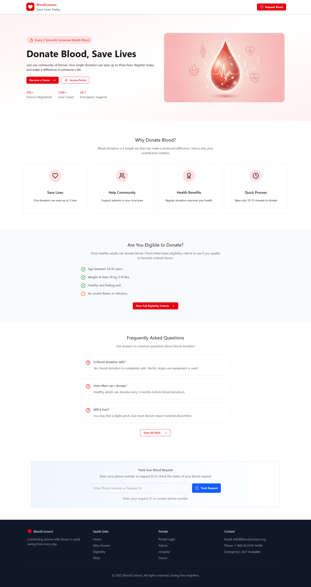
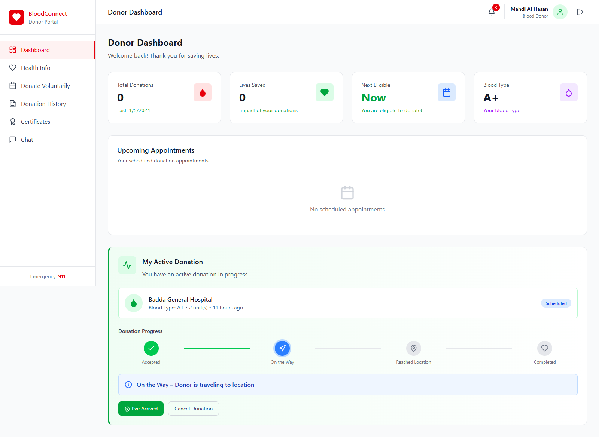
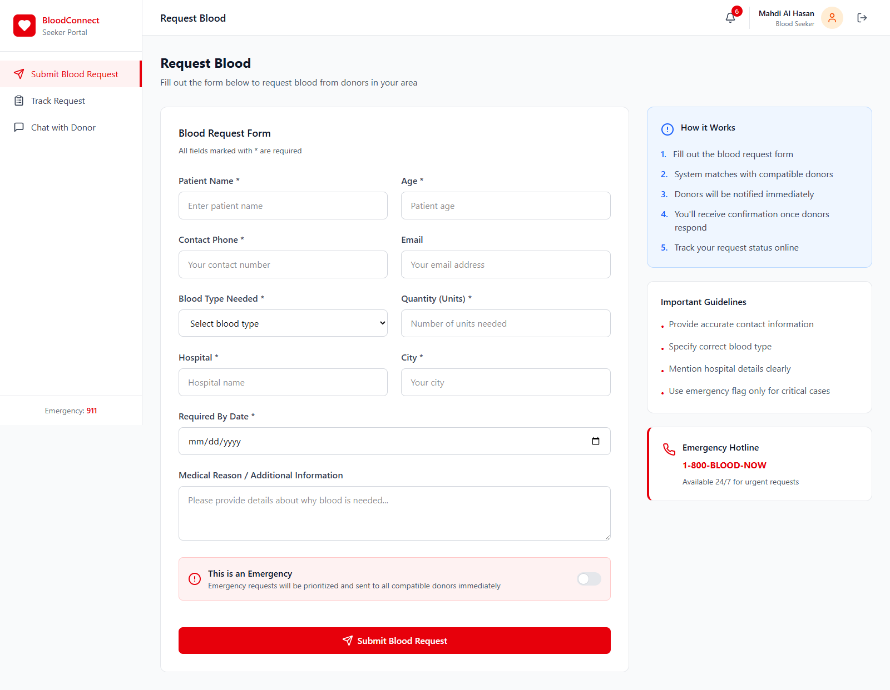
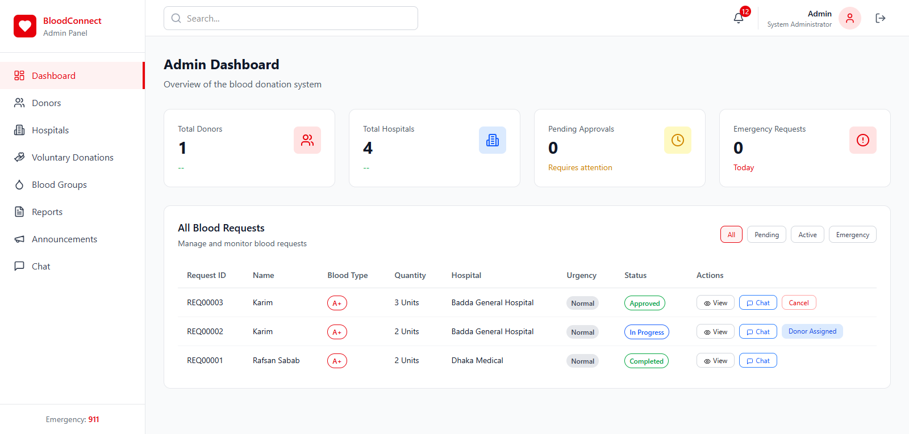
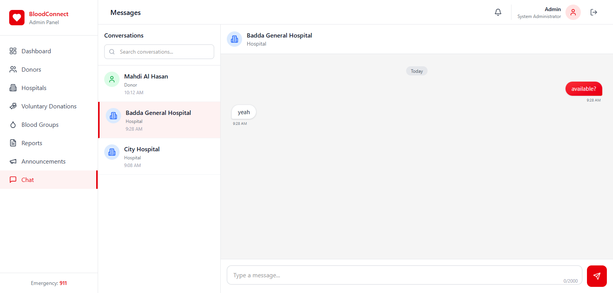

# 🚀 BloodConnect - Blood Donation & Emergency Request Management System

A comprehensive web-based blood donation management platform that connects blood donors, seekers, hospitals, and administrators. The system facilitates emergency blood requests, voluntary donations, and streamlines the entire blood donation lifecycle from request to fulfillment.

---

## 🔹 Table of Contents

1. [Project Overview](#project-overview)
2. [Features by Role](#features-by-role)
3. [System Architecture](#system-architecture)
4. [Technology Stack](#technology-stack)
5. [Database Schema](#database-schema)
6. [Request Lifecycle](#request-lifecycle)
7. [Donation Lifecycle](#donation-lifecycle)
8. [Notification System](#notification-system)
9. [Chat System](#chat-system)
10. [Installation Guide](#installation-guide)
11. [Environment Setup](#environment-setup)
12. [Database Setup](#database-setup)
13. [Default Roles & Access](#default-roles--access)
14. [Security Practices](#security-practices)
15. [API Endpoints](#api-endpoints)
16. [Known Limitations](#known-limitations)
17. [Future Improvements](#future-improvements)
18. [Screenshots](#screenshots)
19. [License](#license)

---

## 🔹 Project Overview

BloodConnect is a full-stack web application designed to address the critical need for efficient blood donation management. The platform serves as a bridge between blood seekers (patients/families), blood donors, hospitals, and system administrators.

### 🔸 The Problem
During medical emergencies, finding a compatible blood donor quickly is often a matter of life and death. The traditional process is uncoordinated, relying heavily on social media shares or contacting blood banks individually. This causes critical delays, lacks real-time visibility into donor availability, and creates communication gaps between hospitals, patients, and donors.

### 🔸 The Solution
BloodConnect provides a centralized, real-time platform that instantly matches blood requests with available, compatible donors in the required location. By automating the matching process, strictly tracking donor health eligibility (e.g., 90-day cooldown periods), and providing an internal chat system for direct communication, it eliminates crucial delays and brings structure to emergency blood management.

### 🔸 Key Objectives

- **Streamline Blood Requests**: Enable seekers and hospitals to submit blood requests that get matched with compatible donors
- **Donor Management**: Track donor eligibility, health information, and donation history
- **Emergency Handling**: Prioritize and expedite emergency blood requests
- **Voluntary Donations**: Facilitate proactive blood donations without active requests
- **Real-time Communication**: Enable contextual chat between stakeholders
- **Administrative Oversight**: Provide comprehensive dashboards for system monitoring

---

## 🔹 Features by Role

### 🔸 Blood Donor

- **Registration & Profile**: Register with blood group, health information, and location
- **Request Matching**: View compatible blood requests based on blood type and location
- **Accept Donations**: Accept blood requests and track donation status
- **Voluntary Donations**: Submit voluntary donation offers to preferred hospitals
- **Health Tracking**: Maintain health records for eligibility verification
- **Donation History**: View complete donation history with statistics
- **Certificates**: Download donation and achievement certificates
- **Notifications**: Receive alerts for matching requests and appointment reminders
- **Chat**: Communicate with hospitals and seekers

### 🔸 Blood Seeker

- **Request Submission**: Submit blood requests with patient details and urgency level
- **Request Tracking**: Track request status from submission to fulfillment
- **Donor Communication**: Chat with assigned donors (after acceptance)
- **Notifications**: Receive updates on request status changes

### 🔸 Hospital

- **Request Management**: Create and manage blood requests for patients
- **Donor Discovery**: View available donors by blood type and location
- **Voluntary Scheduling**: Schedule voluntary donations at the hospital
- **Appointment Management**: Track and manage donation appointments
- **Donation Completion**: Mark donations as completed
- **Reports**: View donation statistics and history

### 🔸 Administrator

- **User Management**: Approve/reject donor and hospital registrations
- **Request Oversight**: Review and approve/reject blood requests
- **Voluntary Management**: Approve/reject voluntary donation requests
- **Announcements**: Create and schedule system-wide announcements
- **Reports & Analytics**: Generate reports on donations, requests, and blood inventory
- **Blood Group Statistics**: Monitor blood group distribution and availability
- **System Monitoring**: View overall system health and activity

---

## 🔹 System Architecture

```
┌─────────────────────────────────────────────────────────────────┐
│                        CLIENT LAYER                              │
│  ┌──────────┐  ┌──────────┐  ┌──────────┐  ┌──────────┐        │
│  │  Donor   │  │  Seeker  │  │ Hospital │  │  Admin   │        │
│  │Dashboard │  │Dashboard │  │Dashboard │  │Dashboard │        │
│  └────┬─────┘  └────┬─────┘  └────┬─────┘  └────┬─────┘        │
│       │             │             │             │               │
│       └─────────────┴─────────────┴─────────────┘               │
│                          │                                       │
│              ┌───────────▼───────────┐                          │
│              │   Vanilla JavaScript  │                          │
│              │   + Tailwind CSS      │                          │
│              └───────────┬───────────┘                          │
└──────────────────────────┼──────────────────────────────────────┘
                           │ HTTP/JSON
┌──────────────────────────▼──────────────────────────────────────┐
│                        API LAYER                                 │
│  ┌────────────────────────────────────────────────────────────┐ │
│  │                    PHP REST APIs                            │ │
│  │  ┌──────┐ ┌──────┐ ┌─────────┐ ┌──────┐ ┌─────────────┐   │ │
│  │  │ Auth │ │Donor │ │Hospital │ │Admin │ │Notifications│   │ │
│  │  └──────┘ └──────┘ └─────────┘ └──────┘ └─────────────┘   │ │
│  └────────────────────────────────────────────────────────────┘ │
│  ┌────────────────────────────────────────────────────────────┐ │
│  │                 Middleware & Services                       │ │
│  │  ┌─────────────┐  ┌─────────────────────┐                  │ │
│  │  │    Auth     │  │NotificationService  │                  │ │
│  │  │ Middleware  │  │                     │                  │ │
│  │  └─────────────┘  └─────────────────────┘                  │ │
│  └────────────────────────────────────────────────────────────┘ │
└──────────────────────────┬──────────────────────────────────────┘
                           │ PDO
┌──────────────────────────▼──────────────────────────────────────┐
│                      DATA LAYER                                  │
│  ┌────────────────────────────────────────────────────────────┐ │
│  │                    MySQL Database                           │ │
│  │  ┌───────┐ ┌────────┐ ┌───────────┐ ┌────────────────┐    │ │
│  │  │ Users │ │ Donors │ │ Hospitals │ │ Blood Requests │    │ │
│  │  └───────┘ └────────┘ └───────────┘ └────────────────┘    │ │
│  │  ┌───────────┐ ┌───────────────┐ ┌─────────────────────┐  │ │
│  │  │ Donations │ │ Notifications │ │ Voluntary Donations │  │ │
│  │  └───────────┘ └───────────────┘ └─────────────────────┘  │ │
│  └────────────────────────────────────────────────────────────┘ │
└─────────────────────────────────────────────────────────────────┘
```

---

## 🔹 Technology Stack

| Layer                  | Technology                                         |
| ---------------------- | -------------------------------------------------- |
| **Frontend**           | HTML5, Tailwind CSS 4.0, Vanilla JavaScript (ES6+) |
| **Icons**              | Lucide Icons                                       |
| **Validation**         | Zod (client-side schema validation)                |
| **Backend**            | PHP 8.0+                                           |
| **Database**           | MySQL 8.0 / MariaDB 10.4+                          |
| **Authentication**     | PHP Sessions with bcrypt password hashing          |
| **Development Server** | Vite (for Tailwind compilation)                    |
| **Production Server**  | Apache (XAMPP/LAMP/WAMP)                           |

---

## 🔹 Database Schema

### 🔸 Core Tables

| Table          | Description                                             |
| -------------- | ------------------------------------------------------- |
| `users`        | Base user table for authentication (all roles)          |
| `donors`       | Extended donor information (linked to users)            |
| `hospitals`    | Extended hospital information (linked to users)         |
| `seekers`      | Extended seeker information (linked to users)           |
| `blood_groups` | Reference table for blood types with compatibility data |

### 🔸 Transaction Tables

| Table                 | Description                                 |
| --------------------- | ------------------------------------------- |
| `blood_requests`      | Blood requests from seekers/hospitals       |
| `donations`           | Donation records linking donors to requests |
| `voluntary_donations` | Voluntary donation offers from donors       |
| `appointments`        | Scheduled donation appointments             |
| `certificates`        | Generated donation certificates             |

### 🔸 Support Tables

| Table           | Description                  |
| --------------- | ---------------------------- |
| `notifications` | User notifications           |
| `chat_messages` | Chat/messaging between users |
| `donor_health`  | Donor health information     |
| `announcements` | System announcements         |

### 🔸 Entity Relationship Summary

```
users (1) ──────< donors (1)
users (1) ──────< hospitals (1)
users (1) ──────< seekers (1)
users (1) ──────< notifications (∞)

blood_groups (1) ──────< donors (∞)
blood_groups (1) ──────< blood_requests (∞)

blood_requests (1) ──────< donations (∞)
donors (1) ──────< donations (∞)
donors (1) ──────< voluntary_donations (∞)
hospitals (1) ──────< voluntary_donations (∞)
```

---

## 🔹 Request Lifecycle

```
┌─────────────────────────────────────────────────────────────────┐
│                    BLOOD REQUEST LIFECYCLE                       │
└─────────────────────────────────────────────────────────────────┘

  SEEKER/HOSPITAL                ADMIN                    DONOR
       │                           │                        │
       │  1. Submit Request        │                        │
       ├──────────────────────────>│                        │
       │                           │                        │
       │     [PENDING]             │                        │
       │                           │                        │
       │                   2. Review & Approve              │
       │                           │                        │
       │     [APPROVED]            │                        │
       │                           │                        │
       │                           │   3. Notify Matching   │
       │                           │      Donors            │
       │                           ├───────────────────────>│
       │                           │                        │
       │                           │            4. Accept   │
       │                           │<───────────────────────┤
       │                           │                        │
       │     [IN_PROGRESS]         │                        │
       │                           │                        │
       │   5. Donation Complete    │                        │
       │<─────────────────────────────────────────────────────
       │                           │                        │
       │     [COMPLETED]           │                        │
       │                           │                        │
       └───────────────────────────┴────────────────────────┘

Status Flow:
PENDING → APPROVED → IN_PROGRESS → COMPLETED
    │         │           │
    └→REJECTED└→CANCELLED └→CANCELLED
```

---

## 🔹 Donation Lifecycle

```
┌─────────────────────────────────────────────────────────────────┐
│                    DONATION STATUS FLOW                          │
└─────────────────────────────────────────────────────────────────┘

    ┌──────────┐
    │ ACCEPTED │  ← Donor accepts request
    └────┬─────┘
         │
    ┌────▼──────┐
    │ ON_THE_WAY│  ← Donor heading to hospital
    └────┬──────┘
         │
    ┌────▼─────┐
    │ REACHED  │  ← Donor arrived at hospital
    └────┬─────┘
         │
    ┌────▼──────┐
    │ COMPLETED │  ← Donation successful
    └───────────┘
         │
    Certificate Generated → Donor Stats Updated → Cooldown Applied

COOLDOWN PERIOD: 90 days between donations (configurable)
```

### 🔸 Voluntary Donation Flow

```
DONOR                    ADMIN                   HOSPITAL
  │                        │                        │
  │  Submit Voluntary      │                        │
  │  Donation Offer        │                        │
  ├───────────────────────>│                        │
  │                        │                        │
  │     [PENDING]          │                        │
  │                        │                        │
  │               Approve  │                        │
  │<───────────────────────┤                        │
  │                        │                        │
  │     [APPROVED]         │                        │
  │                        │                        │
  │                        │      Schedule Donation │
  │                        │<───────────────────────┤
  │                        │                        │
  │     [SCHEDULED]        │                        │
  │                        │                        │
  │                        │        Mark Complete   │
  │<─────────────────────────────────────────────────
  │                        │                        │
  │     [COMPLETED]        │                        │
```

---

## 🔹 Notification System

The system generates notifications for key events across all user roles.

### 🔸 Notification Types

| Code    | Event                                 | Recipients      |
| ------- | ------------------------------------- | --------------- |
| **A1**  | New hospital registration             | All Admins      |
| **A2**  | New donor registration                | All Admins      |
| **A3**  | New blood request submitted           | All Admins      |
| **A4**  | New voluntary donation request        | All Admins      |
| **D1**  | Account approved                      | Donor           |
| **D2**  | Account rejected                      | Donor           |
| **D3**  | Matching blood request available      | Matching Donors |
| **D4**  | Donation accepted confirmation        | Donor           |
| **D5**  | Donation completed                    | Donor           |
| **D6**  | Voluntary donation approved           | Donor           |
| **D7**  | Appointment reminder (24h before)     | Donor           |
| **D12** | Eligibility restored (cooldown ended) | Donor           |
| **H1**  | Hospital account approved             | Hospital        |
| **H2**  | Hospital account rejected             | Hospital        |
| **H3**  | Blood request approved                | Hospital        |
| **H4**  | Donor accepted request                | Hospital        |
| **H5**  | Donation completed                    | Hospital        |
| **S1**  | Blood request submitted               | Seeker          |
| **S2**  | Blood request approved                | Seeker          |
| **S3**  | Donor accepted request                | Seeker          |
| **S4**  | Donation completed                    | Seeker          |
| **S8**  | Request expired                       | Seeker          |

---

## 🔹 Chat System

The chat system enables contextual communication between users based on their relationships.

### 🔸 Chat Permission Rules

| User Role    | Can Chat With                                                               |
| ------------ | --------------------------------------------------------------------------- |
| **Donor**    | Hospitals (with active donations), Seekers (with accepted requests), Admins |
| **Seeker**   | Donors (who accepted their requests), Admins                                |
| **Hospital** | Donors (with active appointments/donations), Admins                         |
| **Admin**    | All users                                                                   |

### 🔸 Features

- Real-time message updates (polling)
- Unread message counts
- Conversation history
- Context-based access control

---

## 🔹 Installation Guide

### 🔸 Prerequisites

- XAMPP 8.0+ (or equivalent LAMP/WAMP stack)
- PHP 8.0+
- MySQL 8.0+ / MariaDB 10.4+
- Node.js 18+ (for development/Tailwind compilation)

### 🔸 Step 1: Clone the Repository

```bash
cd C:\xampp\htdocs
git clone <repository-url> blood-donation-main
cd blood-donation-main
```

### 🔸 Step 2: Install Dependencies

```bash
npm install
```

### 🔸 Step 3: Database Setup

1. Start MySQL from XAMPP Control Panel
2. Open phpMyAdmin (http://localhost/phpmyadmin)
3. Import the database schema:

```bash
# 🚀 Option 1: Via phpMyAdmin
# 🚀 Import the file: database.sql

# 🚀 Option 2: Via command line
mysql -u root < database.sql
mysql -u root blood_donation < data.sql  # Optional: seed data
```

### 🔸 Step 4: Configure Database Connection

Edit `api/config/database.php` if needed:

```php
private $host = 'localhost';
private $db_name = 'blood_donation';
private $username = 'root';
private $password = '';  // Default XAMPP password
```

### 🔸 Step 5: Start Development Server

```bash
# 🚀 For Tailwind CSS compilation (development)
npm run dev

# 🚀 Access the application
# 🚀 http://localhost:5173 (Vite dev server)
```

### 🔸 Step 6: Production Setup

```bash
# 🚀 Build CSS for production
npm run build

# 🚀 Access via Apache
# 🚀 http://localhost/blood-donation-main
```

---

## 🔹 Environment Setup

### 🔸 Apache Configuration

Ensure `mod_rewrite` is enabled for clean URLs:

```apache
# 🚀 In httpd.conf
LoadModule rewrite_module modules/mod_rewrite.so
```

### 🔸 PHP Configuration

Recommended `php.ini` settings:

```ini
display_errors = Off
log_errors = On
error_log = "C:/xampp/php/logs/php_error.log"
session.cookie_httponly = 1
session.cookie_secure = 0  # Set to 1 for HTTPS
```

### 🔸 Cron Job Setup (Optional)

For scheduled notifications:

```bash
# 🚀 Linux/Mac
0 8 * * * php /path/to/cron/scheduled-notifications.php

# 🚀 Windows Task Scheduler
# 🚀 Create task to run: php C:\xampp\htdocs\blood-donation-main\cron\scheduled-notifications.php
```

---

## 🔹 Default Roles & Access

### 🔸 User Roles

| Role         | Registration           | Approval Required |
| ------------ | ---------------------- | ----------------- |
| **Admin**    | Manual (database only) | No                |
| **Donor**    | Public registration    | Yes               |
| **Hospital** | Public registration    | Yes               |
| **Seeker**   | Public registration    | No                |

### 🔸 Account States

| State      | Description             |
| ---------- | ----------------------- |
| `pending`  | Awaiting admin approval |
| `approved` | Full system access      |
| `rejected` | Access denied           |

### 🔸 Test Credentials

For testing purposes, the database comes pre-seeded with the following user accounts:

| Role | Email | Password |
| :--- | :--- | :--- |
| **System Admin** | `admin@bloodconnect.com` | `admin123` |
| **Donor** | `donor@test.com` | `12345678` |
| **Seeker** | `seeker@test.com` | `12345678` |
| **Hospital** | `testhospital@test.com` | `12345678` |
| **Hospital** | `hospital@test.com` | `12345678` |
| **Test Admin** | `admin@test.com` | `12345678` |

*(Note: Additional dummy users ending in `@test.com` are also included, and all use the password `12345678`)*

---

## 🔹 Security Practices

### 🔸 Authentication

- Passwords hashed with `bcrypt` (PASSWORD_BCRYPT)
- Session-based authentication with timeout (1 hour)
- Session regeneration on login

### 🔸 Authorization

- Role-based access control via middleware
- API endpoints protected by role verification
- Admin registration not allowed through public API

### 🔸 Data Protection

- Prepared statements for all SQL queries (PDO)
- Input validation and sanitization
- CORS headers configured

### 🔸 Recommendations for Production

- Enable HTTPS
- Set `session.cookie_secure = 1`
- Configure specific CORS origins (not `*`)
- Implement rate limiting
- Add CSRF token validation

---

## 🔹 API Endpoints

### 🔸 Authentication

| Method | Endpoint                 | Description          |
| ------ | ------------------------ | -------------------- |
| POST   | `/api/auth/register.php` | User registration    |
| POST   | `/api/auth/login.php`    | User login           |
| POST   | `/api/auth/logout.php`   | User logout          |
| GET    | `/api/auth/check.php`    | Check session status |

### 🔸 Donor APIs

| Method | Endpoint                          | Description               |
| ------ | --------------------------------- | ------------------------- |
| GET    | `/api/donor/profile.php`          | Get donor profile         |
| GET    | `/api/donor/requests.php`         | Get matching requests     |
| POST   | `/api/donor/requests/accept.php`  | Accept a request          |
| GET    | `/api/donor/history.php`          | Get donation history      |
| GET    | `/api/donor/eligibility.php`      | Check eligibility         |
| POST   | `/api/donor/voluntary/submit.php` | Submit voluntary donation |

### 🔸 Hospital APIs

| Method | Endpoint                               | Description                 |
| ------ | -------------------------------------- | --------------------------- |
| GET    | `/api/hospital/requests.php`           | Get hospital requests       |
| POST   | `/api/hospital/requests/create.php`    | Create blood request        |
| GET    | `/api/hospital/donors.php`             | Get available donors        |
| POST   | `/api/hospital/voluntary/schedule.php` | Schedule voluntary donation |

### 🔸 Admin APIs

| Method | Endpoint                        | Description         |
| ------ | ------------------------------- | ------------------- |
| GET    | `/api/admin/donors.php`         | List all donors     |
| POST   | `/api/admin/donors/approve.php` | Approve donor       |
| POST   | `/api/admin/donors/reject.php`  | Reject donor        |
| GET    | `/api/admin/requests.php`       | List all requests   |
| GET    | `/api/admin/stats.php`          | Get dashboard stats |
| GET    | `/api/admin/reports.php`        | Generate reports    |

---

## 🔹 Known Limitations

1. **Real-time Updates**: Chat and notifications use polling instead of WebSockets
2. **Blood Compatibility**: System matches exact blood types; advanced compatibility (e.g., O- universal donor) is tracked but not auto-matched
3. **Geolocation**: City-based matching uses exact string comparison
4. **File Storage**: Certificates are generated as HTML, not PDF
5. **Multi-language**: Currently English only
6. **Mobile App**: No native mobile application (responsive web only)

---

## 🔹 Future Improvements

- [ ] WebSocket integration for real-time updates
- [ ] SMS notifications via Twilio/similar
- [ ] Email notifications with templates
- [ ] PDF certificate generation
- [ ] Blood bank inventory management
- [ ] Mobile application (React Native/Flutter)
- [ ] Advanced search with geolocation
- [ ] Multi-language support (i18n)
- [ ] Two-factor authentication
- [ ] OAuth social login
- [ ] Analytics dashboard with charts
- [ ] Blood drive event management

---

## 🔹 Screenshots

### 🔸 Landing Page



### 🔸 Donor Dashboard



### 🔸 Blood Request Form



### 🔸 Admin Dashboard



### 🔸 Chat Interface



---

## 🔹 License

This project is developed for educational purposes. All rights reserved.

---

## 🔹 Author

**BloodConnect Team**

For questions or support, please contact the development team.

---

_Last Updated: June 30, 2026_
